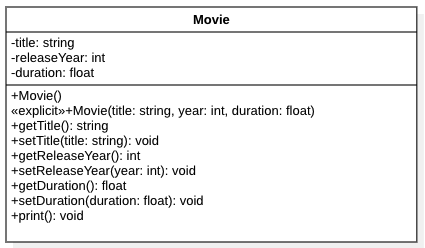

[](https://classroom.github.com/a/TUhIq4DK)
[](https://classroom.github.com/open-in-codespaces?assignment_repo_id=12373157)
# CSCI 2312 - Midterm Exam - October 13, 2023 (A)

# Exercise 1

## Description
An arithmetic progression is a sequence of numbers such that the difference from any succeeding term to its preceding term remains constant throughout the sequence. 
The constant difference is called common difference of that arithmetic progression. 

For instance, the sequence 5, 9, 13, 17, . . . is an arithmetic progression with a common difference of 4.

Arithmetic progressions occur in several situations in the real world. 
For instance, consider the seating of an auditorium, where the first row (the closest to the stage) has five and each row of seats increases by four seats as you walk away from the stage.
Thus, each row seats is given by $S_r = S_{r-1} + 4$ with $S_1 = 5$, and thus the total number of seats in an auditorium with five rows is $S_1+S_2+S_3+S_4+S_5 = 5+9+13+17+21 = 65$.

## ToDo 1 [40 marks]
- Write a **recursive** function `totalSeats` that implements the given recursion. 
- A prototype must be included in `seats.h` and the implementation in `seats.cpp`. 
- A non-recursive implementation will give 0 marks. 
- The function takes three parameters:
    1. number of rows in the auditorium ($r$ in the formula)
    2. The number of seats each row increases as you move away from the stage ($4$ in the example).
    3. The amount of chairs in the first row.
- The function returns the total number of seats in the an auditorium with $n$ rows.

- Write a simple main method that reads these three values and prints the amount of drug in the bloodstream.


# Exercise 2
## Description
You are building a small application that will store a movie catalog. 
From each movie, we know its title, year of release, and duration in hours (e.g., 1.5 hours).
The Application will allow a user to add as many movies as needed and will print the catalog. 

## ToDo 2 [60 marks]
- Create the class Movie as depicted in the UML Diagram below. [30 marks]
    - Class declaration only must be included in `Movie.h` and the implementation in `Movie.cpp`. 
    - The class has the instance attributes and the corresponding getters and setters.
    - The class has two constructors
        - An explicit one that receives three arguments (see UML). 
        - A default constructor (not explicit with no arguments). This constructor initializes all attributes to default values. 
    - The print method should be used to print each movie in the catalog. The output is as follows corresponds of a row on a table. The movie column has 30 characters, 5 for the year, and 7 for each duration column. These sizes do not include the vertical bars or duration units. An example of the output is shown below (table rows).
- Create the `main` application in `main.cpp`. [30 marks]
    - The main application should display and implement the menu shown below. 
        - **(1) Add Movie**: will ask for the movie's information and store it in the catalog (a vector of movies). 
        - **(2) Print Movies**: will print the table as shown.
            - *Hint:* print the header of the table, then traverse the vector and use the print method from each movie.  
        - **(99) Exit**: terminates the program.
    - You **must** use a *vector* to store the movies. 
    - You must use:
        - At least 1 while loop.
        - At least 1 for loop
    - *Penalties*
        - The use of the following will be penalized:
            - Infinite loops (like `while (true)`)
            - Syntax/constructs not discussed in class/textbook (ch 1-7)
        - Your code should compile. Make sure to compile frequently. 
            - Not compiling code will be considered for partial credit only.
    - *Hints*
        - Start small. Compile. Add more functionality. 
        - Making all the implementation at once is more likely to have more errors and may take longer to complete.  

  

### Movie UML


### Movie Menu Example
```
==================
1) Add Movie
2) Print Movies
99) Exit
------------------
Enter option:
```
### Movie Catalog Example
```
|                          MOVIE |  Year | Dur (H)  | Dur (M).   |
|                   Harry Potter |  2001 |     2.5h |     150min |
|           Mission Impossible 1 |  1996 |       2h |     120min |
```
